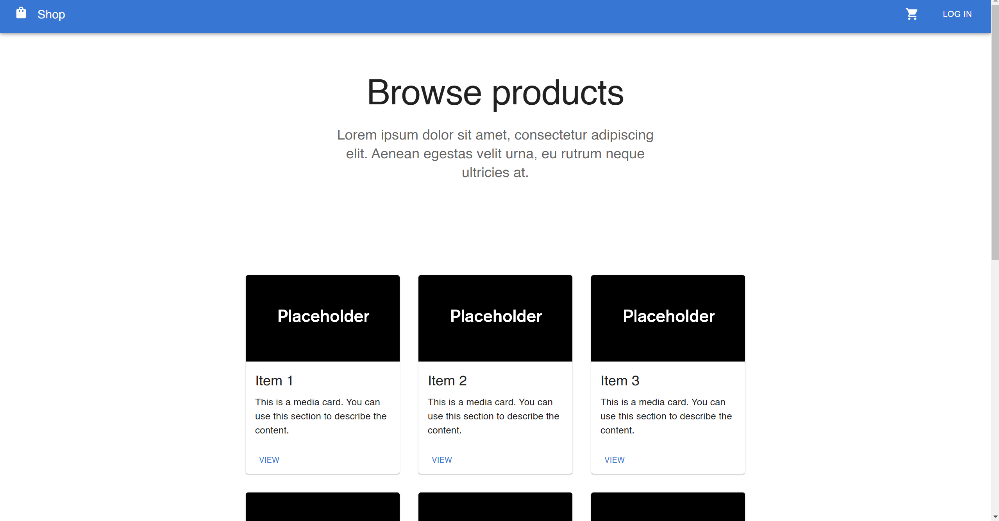
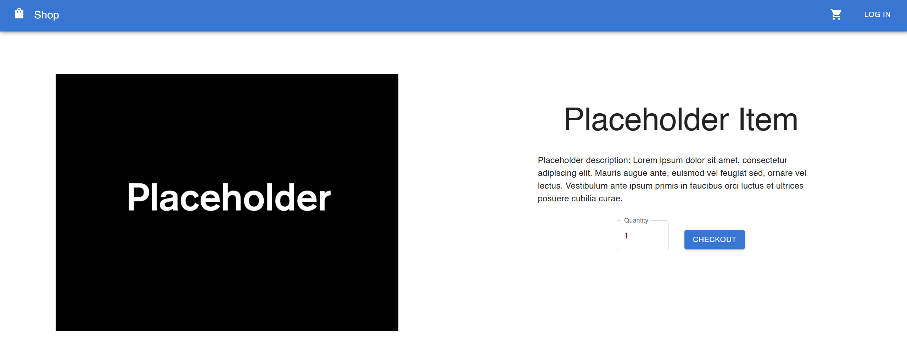
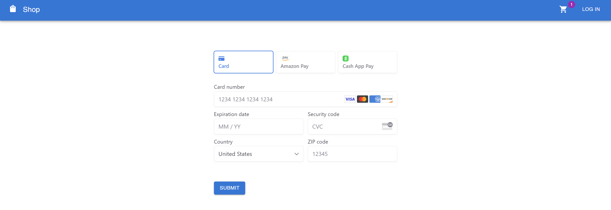

# What is this?
## Note: I have joined the SASE (Society of Asian Scientists and Engineers) web dev team. Check out my more recent work [here](https://github.com/ufsasewebmaster/UF-SASE-Website)! 
This project is a full stack React app built around the Stripe API that implements an online storefront to demonstrate proficiency in web development and relational databases for potential employers. The frontend is built with MaterialUI, while the backend is built with Flask. The website will be updated periodically with new pages and features when I have spare time.

# Key Features
- fully-functioning payment system
- account creation and management
- shopping cart
- MySQL database

# Screenshots

# Setup instructions
Clone the project with `git clone https://github.com/elliot-liu-12/e-commerce_web_app` and install all dependencies. In the project directory, you can run `npm start` to start the frontend and `python -m flask run` or `flask --app run --debug` to start the server. Note that using the checkout function will require a .env file in the `app` directory with a valid Stripe *test* key. Once both the frontend and backend have been started, the website will function normally without any errors.
